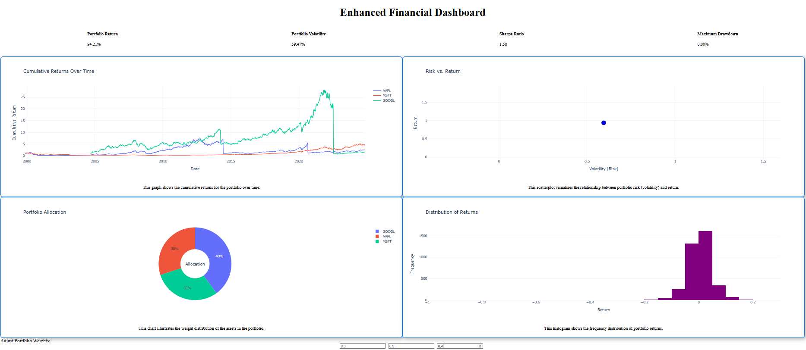

# Enhanced-Finance-Dashboard

## Overview
The Enhanced Financial Dashboard is an interactive web application designed to analyze and visualize financial portfolio performance metrics. It enables users to assess portfolio performance through KPIs, interactive visualizations, and customizable weight adjustments for individual assets. Built using Dash, Flask, and Plotly, this tool provides valuable insights into portfolio returns, risk, and allocation.

## Features

- **Key Performance Indicators (KPIs):**
  - Portfolio Return
  - Portfolio Volatility
  - Sharpe Ratio
  - Maximum Drawdown

- **Interactive Visualizations:**
  - Cumulative Returns Over Time (Line Chart)
  - Risk vs. Return Scatterplot
  - Portfolio Allocation (Pie Chart)
  - Distribution of Returns (Histogram)

- **Dynamic Portfolio Weights:**
  - Users can adjust the weights of individual assets (AAPL, MSFT, GOOGL) to dynamically analyze portfolio performance.

## Technologies Used

- **Frontend:** Dash, Plotly, HTML/CSS
- **Backend:** Flask
- **Data Processing:** Pandas, NumPy
- **API Integration:** Alpha Vantage API

## Installation and Setup

### Prerequisites
- Python 3.8+
- Pipenv or virtualenv (optional for managing dependencies)

### Steps to Run the Project

1. **Clone the Repository**
   ```bash
   git clone <repository-url>
   cd enhanced-financial-dashboard
   ```

2. **Set Up a Virtual Environment (Optional)**
   ```bash
   python -m venv env
   source env/bin/activate  # On Windows: env\Scripts\activate
   ```

3. **Install Dependencies**
   ```bash
   pip install -r requirements.txt
   ```

4. **Set Up the API Key**
   - Replace `API_KEY` in `data_retrieval.py` and `test_endpoints.py` with your Alpha Vantage API key.

5. **Run the Application**
   ```bash
   python app.py
   ```

6. **Access the Dashboard**
   - Open your browser and navigate to `http://127.0.0.1:5000/`.

## Project Structure

- **`app.py`**: Main entry point for the Flask application.
- **`dashboard.py`**: Dash app implementation with layout and callbacks for interactivity.
- **`data_retrieval.py`**: Handles data fetching from the Alpha Vantage API.
- **`risk_metrics.py`**: Computes portfolio performance metrics (e.g., return, volatility, Sharpe ratio).
- **`visualization.py`**: Creates advanced financial visualizations (e.g., cumulative returns, rolling volatility).
- **`test_endpoints.py`**: Scripts for testing API endpoints and functionality.
- **`home.html`**: HTML template for the home page.

## Usage

1. **Adjust Portfolio Weights**:
   - Enter weights for AAPL, MSFT, and GOOGL in the input fields.
   - Ensure the weights sum up to 1 for accurate results.

2. **View Metrics and Visualizations**:
   - KPIs and graphs update dynamically based on the input weights.
   - Analyze the relationship between risk and return, asset allocation, and returns distribution.

## Testing

Use `test_endpoints.py` to test the functionality of API endpoints. Example:
```bash
python test_endpoints.py
```

## Example Screenshots

### Dashboard
Below is a preview of the final dashboard:


The welcoming screen with navigation to the dashboard.

### Dashboard
Visualizations and KPIs illustrating portfolio performance.

## Future Enhancements
- Add support for more assets and dynamic selection of tickers.
- Implement additional risk metrics like Beta and Sortino Ratio.
- Extend data visualization with rolling Sharpe ratios and trend analysis.
- Deploy the application on a cloud platform for public accessibility.

## License
This project is licensed under the MIT License. See the [LICENSE](#license) file for details.

## Acknowledgements
- [**Alpha Vantage API**](https://www.alphavantage.co/) for providing financial data.
- [**Dash**](https://dash.plotly.com/) and [**Plotly**](https://plotly.com/) for creating the interactive visualizations.
- [**Flask**](https://flask.palletsprojects.com/) for powering the backend of the application.

---

For any issues or contributions, feel free to raise a ticket or submit a pull request in the repository.
